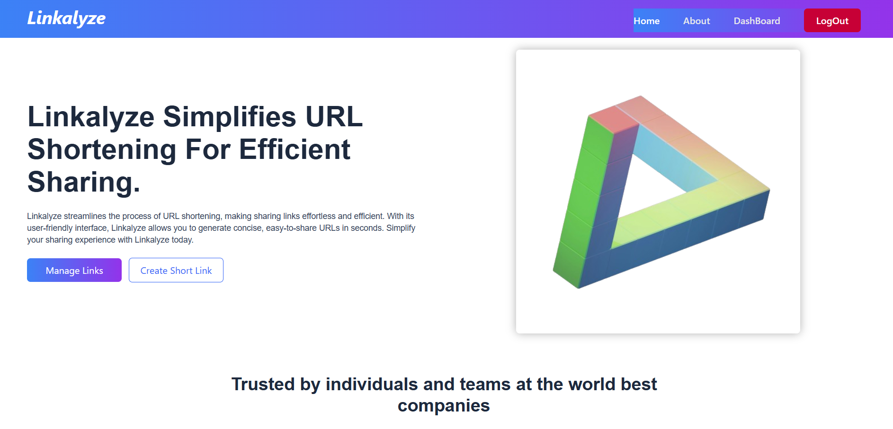
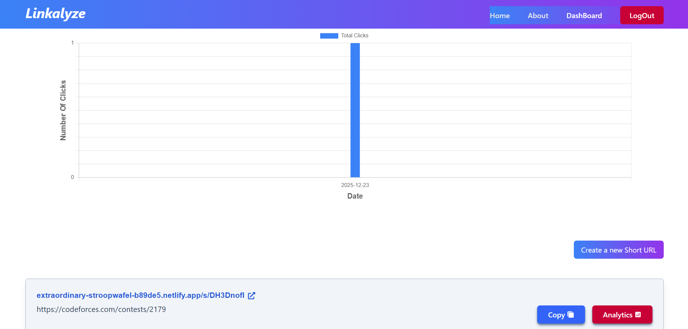

# 🔗 Linkalyze

**Linkalyze** is a modern and minimal link management web application that helps users organize, manage, and share all their important links from a single dashboard.

🌐 **Live Demo:**  
https://extraordinary-stroopwafel-b89de5.netlify.app/

---

## ✨ Overview

Linkalyze provides a clean interface to create a centralized hub for links.  
It is designed with simplicity and usability in mind, making it ideal for personal portfolios, social media bios, and professional link sharing.

---

## 📸 Screenshots

### 🏠 Home Page

### 📊 Dashboard

---

## 🚀 Features

- 🔗 Add and manage multiple links
- 📊 Dashboard view for organized access
- 🎨 Clean and modern UI
- 📱 Fully responsive design
- ⚡ Fast and lightweight frontend
- 🌐 Deployed on Netlify

---

## 🛠 Tech Stack

- **React**
- **JavaScript (ES6+)**
- **HTML5**
- **CSS / Tailwind CSS**
- **Springboot**
- **Spring **Security****
- **JWT auth**
- **Docker**
- **MySQL**
- **NeonDB**
- **Netlify** (Deployment)

